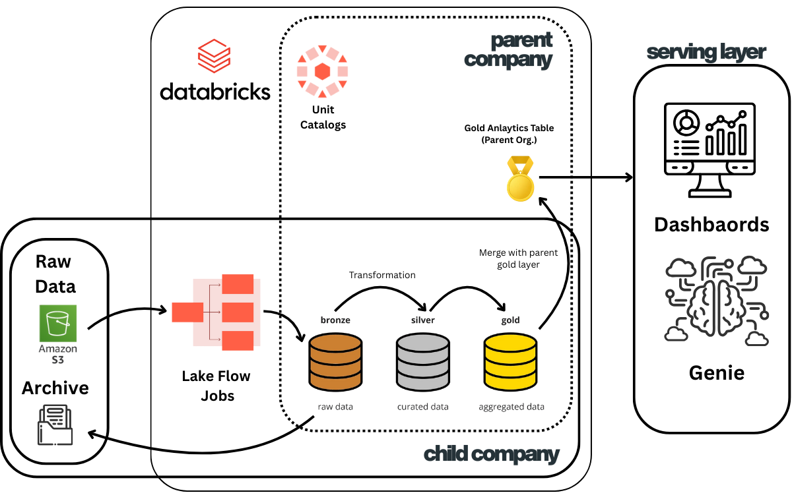
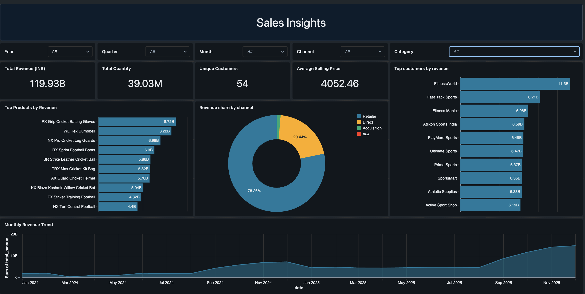
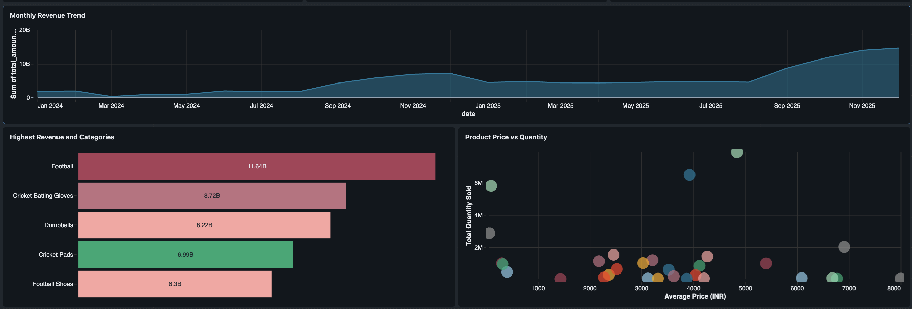

# 🏢 End-to-End Data Engineering Pipeline for Merging an Acquired Company Into a Unified Databricks Lakehouse

This project demonstrates a **full production-grade data engineering workflow** built on **Databricks Lakehouse**, designed for a real-world scenario where a **parent company acquires a child company** and needs to **ingest, clean, transform, merge, and unify** the acquired company’s data with its existing enterprise analytics ecosystem.

The architecture supports:
- Multi-layer medallion design (Bronze → Silver → Gold)
- Unit catalogs for enterprise-wide governance
- Automated ingestion from S3 via LakeFlow Jobs
- Gold-layer merging between child company and parent company
- Centralized dashboarding and LLM-driven analytics using Databricks Genie

---

## 📊 Architecture Overview



)

---

## 🧠 Business Context

A **parent company** has recently **acquired a child company** whose raw data exists in **Amazon S3**, containing:
- Unstructured CSVs  
- Inconsistent schemas  
- Raw ERP extracts  
- Historical archives  

The goal is to onboard the acquired data into the **parent company's analytics system**, standardize formats, merge reference structures, and expose unified insights via **Databricks dashboards and Genie**.

This architecture solves the full set of challenges:
- Schema drift  
- Missing or inconsistent fields  
- Duplicated products, customers, and transactions  
- Conflicting business rules  
- Variations in naming and categorization  
- Scalability and governance across two orgs  

---

## 🏗️ End-to-End Pipeline Breakdown

### **1. Raw Data Layer (Landing Zone — Amazon S3)**  
The acquired company's raw data lands in S3:
- Sales exports  
- Product lists  
- Pricing sheets  
- Customer files  
- Raw logs and archives  

This data is **unstructured and inconsistent**, requiring ingestion and schema normalization.

### **2. LakeFlow Jobs — Automated Ingestion**
Databricks LakeFlow orchestrates:
- Auto-ingest from S3  
- File-based triggers  
- Schema inference and evolution  
- Deduplication  
- Raw data tracking  

Jobs run on a schedule to pull new files from S3 → Bronze.

---

## 🥉 **Bronze Layer — Raw Data**
The Bronze tables store:
- Row-level raw data  
- Minimal processing  
- File metadata (_filename, _ingest_time)  

Purpose:
- Preserve original history  
- Handle ingestion consistency  
- Enable replay and debugging  

---

## 🥈 **Silver Layer — Cleaned & Curated Data**
Transformation includes:
- Data type standardization  
- Null handling  
- Surrogate key creation  
- Category mapping  
- Customer code unification  
- Pricing standardization (INR normalization)  
- Reference table joining  

Outcome:
- Analytics-ready data  
- Fully consistent schemas between companies  

---

## 🥇 **Gold Layer — Aggregated Analytics**
Gold tables represent:
- Fact sales tables  
- Dimensional models (dim_product, dim_customer)  
- Aggregations (daily, monthly, quarterly metrics)  
- Business KPI-level rollups  

This is where the **acquired company’s Gold layer merges with the parent company’s Gold layer**, forming a **unified enterprise analytics dataset**.

---

## 🔗 **Merging Child Company Data With Parent Company Data**

The child company’s gold datasets are aligned to the parent company’s business conventions:

- Category standardization  
- Platform mapping  
- Unified customer segments  
- Harmonized fiscal calendar  
- Product reference merging via SKUs  
- Duplicate entity resolution  

A new **Parent Org Gold Analytics Table** is generated, representing combined sales and product data.

This unified table powers company-wide analytics & reporting.

---

## 📊 Serving Layer — Dashboards & Genie

The parent company uses:
- **Databricks Dashboards**  
- **Databricks Genie (LLM analytics)**  

Dashboards include key KPIs, trends, and insights such as those displayed in your FMCG report  [oai_citation:0‡fmcg_dashboard.pdf](sediment://file_000000003ae0720881f45e911ad73d6d):
- Total revenue (₹119.93B)
- Total quantity (39.03M units)
- Category revenue breakdown
- Customer revenue leaders
- Monthly performance trends
- Price vs Quantity visualizations (scatter bubble charts)
- Category-level revenue insights

Genie allows ad-hoc analysis using natural language:
> “Show revenue contribution by category in Q3.”  
> “Which customers purchased high-value products last quarter?”  
> “Compare child-company sales vs parent-company sales YOY.”

---

## 🚀 Key Features

### ✔ **Multi-Org Governance via Unity Catalog**
- Isolated child company catalog  
- Parent organization catalog  
- Controlled merge at the Gold layer  
- Full auditability  

### ✔ **Medallion Architecture**
- Bronze → Silver → Gold  
- Clean separation of concerns  
- Scalable, maintainable pipelines  

### ✔ **Automated ETL with LakeFlow**
- File-based ingestion  
- Incremental pipeline  
- Job orchestration  

### ✔ **Enterprise Analytics**
- Unified reporting  
- Self-service dashboards  
- AI-powered insights via Genie  

---

## 🛠️ Technologies Used

| Layer | Technology |
|-------|------------|
| Storage | Amazon S3 |
| Ingestion | Databricks LakeFlow |
| Processing | Databricks Workflows, Spark SQL, PySpark |
| Governance | Unity Catalog |
| Orchestration | Delta Live Tables / LakeFlow Jobs |
| Serving | Databricks Dashboards, Genie |
| Formats | Delta Tables, Parquet, CSV |

---

## 📈 Example Dashboards  
The project includes sales insights and product-level analytics such as those shown in the uploaded PDF  [oai_citation:1‡fmcg_dashboard.pdf](sediment://file_000000003ae0720881f45e911ad73d6d):

- Revenue share by channel  
- Top products by revenue  
- Highest-performing categories  
- Price vs Quantity bubble analysis  
- Monthly revenue trend  
- KPI summary tiles  

---

## 📦 Repository Structure
```
0_data/
│
├── 1_parent_company/
│   ├── full_load/
│   └── incremental_load/
│
├── 2_child_company/
│   ├── full_load/
│   │   ├── customers/
│   │   ├── gross_price/
│   │   ├── orders/
│   │   └── products/
│   └── incremental_load/
│
1_codes/
│
├── 1_setup/
│   ├── dim_date_table_creation.ipynb
│   ├── setup_catalog.ipynb
│   └── utilities.ipynb
│
├── 2_dimension_data_processing/
│   ├── 1_customers_data_processing.ipynb
│   ├── 2_products_data_processing.ipynb
│   └── 3_pricing_data_processing.ipynb
│
├── 3_fact_data_processing/
│   ├── 1_full_load_fact.ipynb
│   └── 2_incremental_load_fact.ipynb
│
2_dashboarding/
│   ├── Dashboard_full
│   ├── Dashboard_p1
│   ├── Dashboard_p2
│   ├── denormalise_table_query_fmcg.txt
│   ├── fmcg_dashboard.pdf
│   └── README.md (dashboard documentation)
│
resources/
│   ├── databricks_project.excalidraw
│   └── project_architecture.png

```

# 🙌 Conclusion
This repository provides a **complete, scalable Databricks Lakehouse blueprint** for integrating an acquired company’s data into an enterprise analytics ecosystem.  
It combines:
- Medallion architecture  
- Full + incremental ingestion pipelines  
- Dimension & fact processing  
- Governance via Unity Catalog  
- Gold-layer merging  
- Enterprise dashboards  
